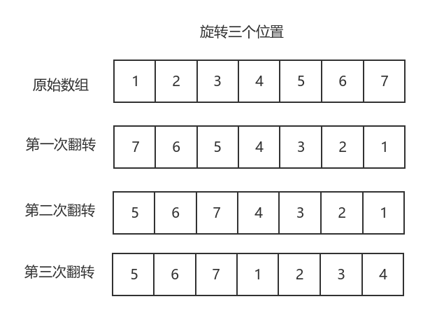

### 原地删除数组中的重复项

> 使用双指针，一个指针在前，另一个指针往后找到一个不相同的元素后，将该元素写到前面来，前一个指针在移动，最后返回新的数组长度就行

* 时间复杂度 O(n)  空间复杂度O(1)

### 买卖股票的最佳时机 II

> 只考虑用贪心算法，将所有上升的值都加起来，就是我们最大化的利润值

* 时间复杂度 O(n)  空间复杂度 O(1)

### 旋转数组

这只是一个一维的数组进行旋转

> * 一：每次移动一个，直到旋转到结果。若向右旋转k个，时间复杂度 O(kn) 空间复杂度 O(1)
> * 二：通过计算去模算出每个元素的最后位置，移动到一个新的数组中去。时间/空间 O(n)/O(n)
> * 三：a移动到b后，接着寻找b要移动到的位置，跟着这条链子一直移动下去，直到这条链路上的元素都移动过了，再检查是否全部的元素都移动到了最终的位置，如果没有，从一个新的待移动元素开始，直到全部移动完成。时间/空间 O(n)/O(1)
> * 四：通过数组直接翻转实现，如下图。时间/空间 O(n)/O(1)

### 存在重复元素

一维数组，有重复，返回true，否则返回false

> * 一：暴力破解很容易，但是不可取
> * 二：先排序，然后遍历一遍就可以了
> * 三：使用哈希表来做映射，避免多次扫描，空间换时间
> * 四：高级语言可以使用集合去重，之后比较长度是否变化就行了

### 只出现一次的数字

一个一维数组，找到唯一一个只出现一次的数字，其余数字均出现两次

> * 一：先排序，然后对对碰消除
> * 二：使用异或运算，异或运算：a^a=0，a^0=a，a^b^c=a^c^b。异或运算可以消除偶数个重复的元素
> * 三：高级语言使用集合去重就可

### 两个数组的交集 II

两个一维数组，交集中元素的个数应该与相交的次数相同，如A={1,1,...}，B={1,1,1,...}，那交集中应该有两个1

> * 一：使用哈希映射，将短的数组映射后，记录各个元素出现的次数，之后再遍历一遍长的数组，与哈希表对照，每找到一个相同的元素后将次数减一即可
> * 二：先排序，然后使用双指针，找到相同的元素后，两个指针都往后移动，否则值小的指针往后移动，直到其中一个数组遍历完成

### 加一

给定一个由 **整数** 组成的 **非空** 数组所表示的非负整数，在该数的基础上加一，数组中每个元素只存储单个数字

> * 一：组合出原来的数字，加一后在拆分成数组（**未提交成功**，可能超过了 int 的界限）
> * 二：模拟加法运算的过程，从后往前加，只有遇到 9 才需要进位（时间空间皆为 O(n）

### 移动零

一维数组将 0 全部移动到数组尾部，同时保持非零数字的相对位置不变

> 找到第一个为零的数，然后往后找到第一个不为零的数，进行位置交换，之后重复该操作，直到找不到不为零的数时结束

### 两数之和

从一维数组中找出两个数的和等于目标值，答案唯一，同一个元素在答案里不能重复出现，返回两数下标

> * 一：循环嵌套，时间复杂度为 O(n^2)
> * 二：使用哈希映射，避免重复查找

### 有效的数独

二维数据中存了一个数独，根据数独的规则判断已经填入的数字是否有效

> * 一：这里有三个检测规则，我们建立三张表的存储信息，行记录表，列记录表，九宫格记录，通过 (i / 3) * 3 + (j / 3) 计算将同一个九宫格的数字映射到同一个维度，采用空间换时间的操作
> * 二：可以使用位运算，改为一维数组，还没看懂：https://leetcode.cn/leetbook/read/top-interview-questions-easy/x2f9gg/

### 旋转图像

将一个矩阵（二维数组）顺时针旋转90度

> * 一：两次遍历，声明一个与原来一样的矩阵，第一次遍历将每个数据填入旋转后的位置，第二次遍历将旋转完成的数据拷贝回原矩阵
> * 二：原地旋转

> * 三：翻转的过程可以转换为交换过程，先行进行倒序，再按对角线交换
